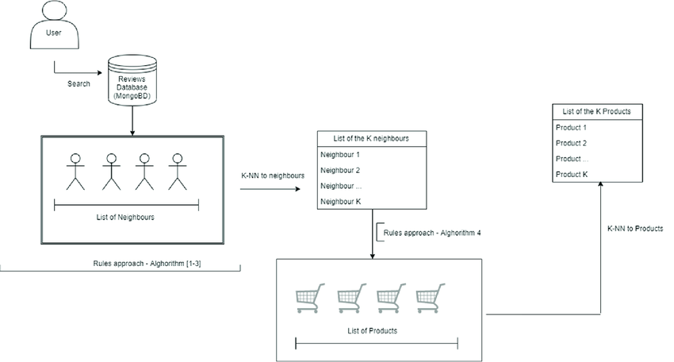

# A-Hybrid-Ontology-Based-Recommendation-System-in-e-Commerce

This is for that article  https://www.researchgate.net/publication/337103910_A_Hybrid_Ontology-Based_Recommendation_System_in_e-Commerce   
<b>Note :</b> 
That's not my own article but i built similair system    

# Main ideas :

The main contributions of this work are the following: 
 We propose a new e-commerce recommendation system, which combines collaborative filtering
with ontology-based recommenders; 
 The proposed recommendation system considers not only the users with similar preferences to
the active user but also obtains knowledge about the user, their neighbours, products and the
relationship between them; 
 Our proposal increases the number of recommended products from categories which the active
user has not yet purchased; 
 The proposed system is scalable, which means that it maintains good level performance when the
workload increases.   

# link for the original dataset : 
https://jmcauley.ucsd.edu/data/amazon/ 
(be sure to download the 5-core data --> mean the user have at least 5 reviews )  

# links for data after preprocessing 

https://drive.google.com/file/d/1hlH-9_QW2h4crFFULcWvAThk6hi1MKIY/view?usp=sharing  

https://drive.google.com/file/d/1nmhndcFa5n61ND0vusfFL143aUB_eH3_/view?usp=sharing  

# Overview of the hybrid ontology-based approach.

